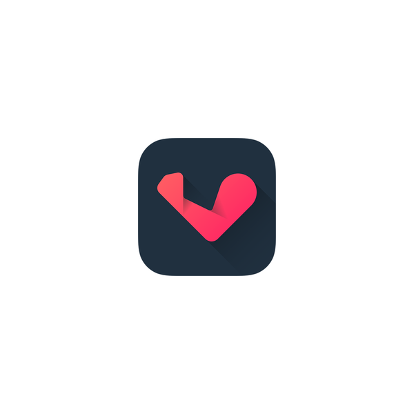
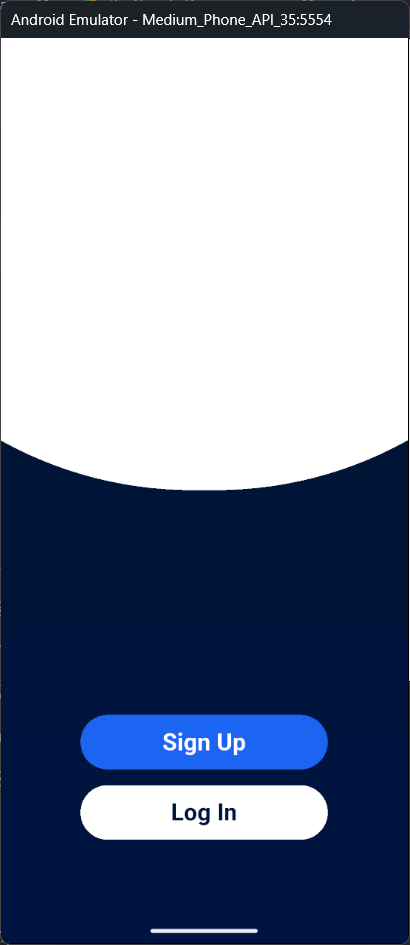
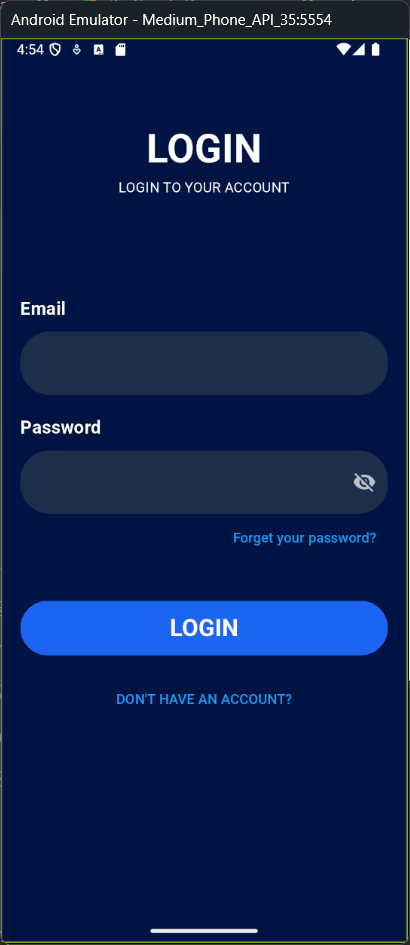
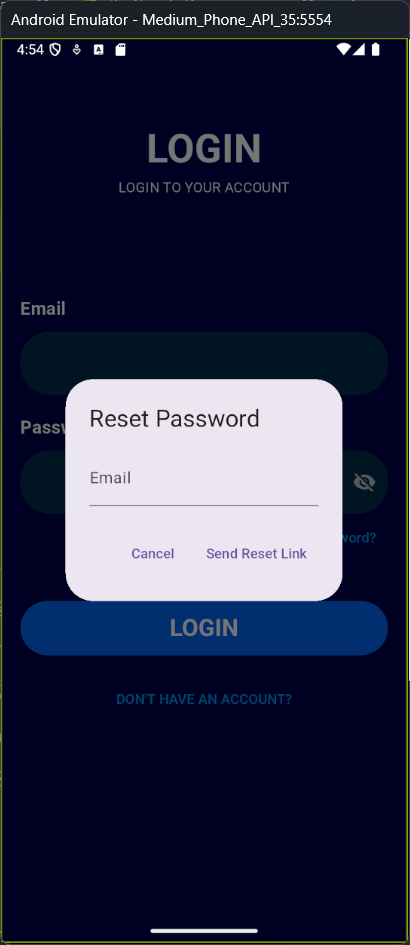
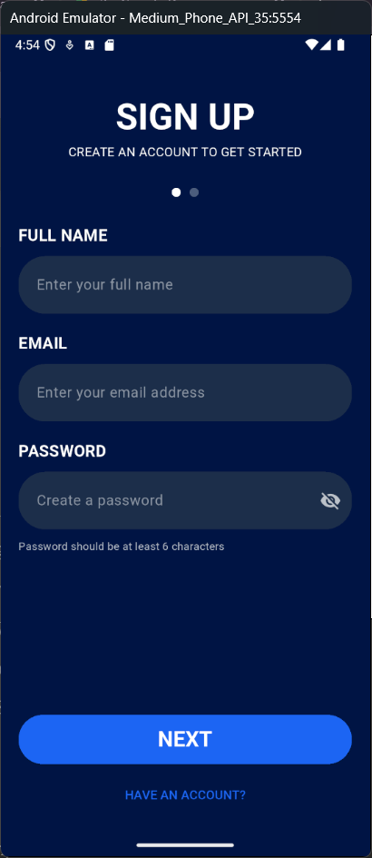
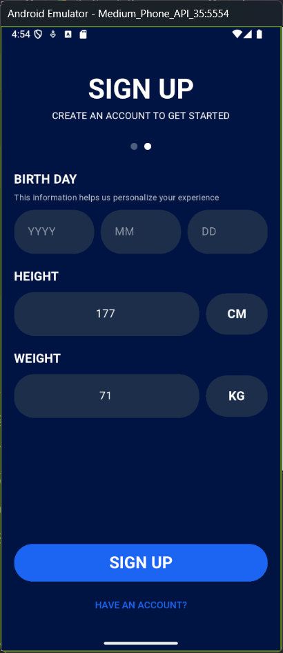
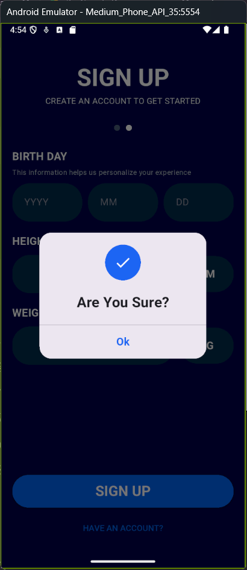

# Fitness App 🏃‍♂️💪


## 📱 Overview

A modern fitness application built with Flutter that enables users to track their fitness goals, monitor daily activities, and access weather information for planning outdoor workouts. This app implements Firebase Authentication for secure user management.

### 🎬 Demo Video

[](assets/videos/task1.mp4)

*Click the image above to watch the demo video*

## ✨ Features

- **🔐 Authentication System**
  - Email & Password Sign-up/Login
  - Password Reset Functionality
  - User Profile Management

- **📊 Activity Tracking**
  - Daily Steps Counter
  - Distance Tracking
  - Calories Burned Calculation
  - Heart Rate Monitoring
  - Visual Progress Charts

- **🌦️ Weather Integration**
  - Real-time Weather Data
  - Location-based Forecasts
  - Interactive Map Interface

- **📱 Responsive Design**
  - Adapts to various screen sizes
  - Consistent experience across devices

## 📸 Screenshots

<table>
  <tr>
    <td align="center">
      
      <br/>شاشة الترحيب
    </td>
    <td align="center">
      
      <br/>تسجيل الدخول
    </td>
    <td align="center">
      
      <br/>استعادة كلمة المرور
    </td>
  </tr>
  <tr>
    <td align="center">
      
      <br/>إنشاء حساب - البيانات الأساسية
    </td>
    <td align="center">
      
      <br/>إنشاء حساب - البيانات الإضافية
    </td>
    <td align="center">
      
      <br/>تأكيد إنشاء الحساب
    </td>
  </tr>
</table>

## 🏗️ Architecture

This project follows **Clean Architecture** principles to ensure:
- Separation of concerns
- Testability
- Maintainability
- Scalability

### Project Structure

```
lib/
├── core/
│   ├── di/              # Dependency Injection
│   ├── error/           # Error Handling
│   ├── network/         # Network Utilities
│   ├── routes/          # App Navigation
│   └── utils/           # Common Utilities
├── features/
│   ├── auth/            # Authentication Feature
│   │   ├── data/        # Data Layer
│   │   ├── domain/      # Domain Layer
│   │   └── presentation/# Presentation Layer
│   ├── home/            # Home & Activity Feature
│   └── weather/         # Weather Feature
└── main.dart
```

## 🛠️ Tech Stack

- **Flutter**: UI Framework
- **Firebase**: Authentication & Backend
- **BLoC/Cubit**: State Management
- **Geolocator**: Location Services
- **Weather API**: Real-time Weather Data
- **Clean Architecture**: Project Structure
- **Dependency Injection**: Service Locator Pattern

## 🚀 Getting Started

### Prerequisites

- Flutter SDK (latest version)
- Dart SDK
- Firebase Account
- Weather API Key (from OpenWeatherMap or similar service)

### Installation

1. Clone the repository:
   ```bash
   git clone https://github.com/yourusername/fitness_app.git
   cd fitness_app
   ```

2. Install dependencies:
   ```bash
   flutter pub get
   ```

3. Configure Firebase:
   - Create a new Firebase project
   - Add Android/iOS apps in Firebase console
   - Download and place the configuration files
   - Enable Email/Password authentication

4. Add your Weather API key:
   - Create a `.env` file in the project root
   - Add your API key: `WEATHER_API_KEY=your_api_key_here`

5. Run the app:
   ```bash
   flutter run
   ```

## ✅ Completed Tasks

- [x] Implemented Login & Sign-up using Firebase Authentication
- [x] Followed Clean Architecture principles
- [x] Utilized BLoC/Cubit for state management
- [x] Created responsive UI for different screen sizes
- [x] Integrated location services
- [x] Connected to weather API
- [x] Implemented activity tracking features
- [x] Added user profile management

## 🧪 Testing

```bash
# Run unit tests
flutter test

# Run integration tests
flutter test integration_test
```

## 📄 License

This project is licensed under the MIT License - see the [LICENSE](LICENSE) file for details.

## 🤝 Contributing

Contributions are welcome! Please feel free to submit a Pull Request.

---

Developed with ❤️ by [mohamed12344556](https://github.com/mohamed12344556/Fitness-App.git)
