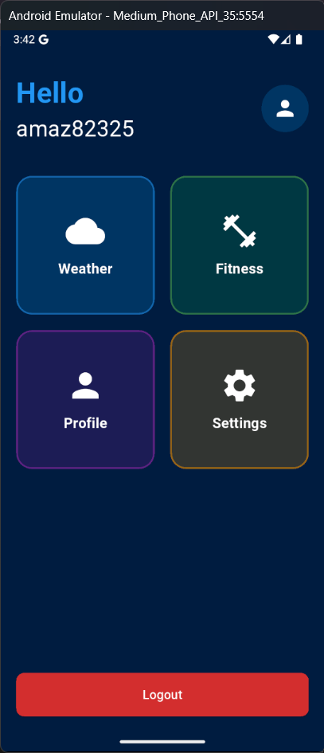

# Fitness App 🏃‍♂️💪


## 📱 نظرة عامة

تطبيق لياقة بدنية عصري مبني بواسطة Flutter يمكن المستخدمين من تتبع أهدافهم الرياضية، مراقبة الأنشطة اليومية، والوصول إلى معلومات الطقس لتخطيط التمارين الخارجية. يستخدم التطبيق Firebase Authentication لإدارة المستخدمين بشكل آمن.

### 🎬 فيديو توضيحي
🔗 **[اضغط هنا لمشاهدة العرض التوضيحي](https://drive.google.com/file/d/1AQX28xomD18VSH2rx0knTlVuaqHh4jgg/view?usp=sharing)**  

## ✨ المميزات

- **🔐 نظام المصادقة**
  - تسجيل الدخول وإنشاء حساب باستخدام البريد الإلكتروني وكلمة المرور
  - إمكانية استعادة كلمة المرور
  - إدارة الملف الشخصي للمستخدم

- **📊 تتبع النشاط**
  - عداد الخطوات اليومية
  - تتبع المسافة المقطوعة
  - حساب السعرات الحرارية المحروقة
  - مراقبة معدل ضربات القلب
  - رسوم بيانية لعرض التقدم

- **🌦️ تكامل بيانات الطقس**
  - عرض الطقس الحالي لأي مدينة
  - توقعات الطقس لمدة 3 أيام قادمة
  - تصفح توقعات الأيام المختلفة
  - عرض تفاصيل الحرارة والرطوبة وحالة الطقس

- **🧭 لوحة التحكم المركزية**
  - الوصول السريع إلى جميع ميزات التطبيق
  - عرض ملخص لبيانات المستخدم
  - واجهة سهلة الاستخدام للتنقل بين الشاشات

- **📱 تصميم متجاوب**
  - يتكيف مع مختلف أحجام الشاشات
  - تجربة مستخدم متناسقة عبر جميع الأجهزة
  - شريط تنقل موحد عبر جميع الشاشات

## 📸 لقطات شاشة

<table>
  <tr>
    <td align="center">
      
      <br/>شاشة الترحيب
    </td>
    <td align="center">
      
      <br/>تسجيل الدخول
    </td>
    <td align="center">
      
      <br/>لوحة التحكم
    </td>
  </tr>
  <tr>
    <td align="center">
      
      <br/>الطقس الحالي
    </td>
    <td align="center">
      
      <br/>توقعات الطقس
    </td>
    <td align="center">
      
      <br/>لوحة اللياقة البدنية
    </td>
  </tr>
</table>

## 🏗️ العمارة البرمجية

يتبع هذا المشروع مبادئ **Clean Architecture** لضمان:
- فصل المسؤوليات
- قابلية الاختبار
- سهولة الصيانة
- قابلية التوسع

### هيكل المشروع

```
lib/
├── core/                # الطبقة الأساسية
│   ├── di/              # حقن التبعيات
│   ├── error/           # معالجة الأخطاء
│   ├── api/             # واجهات API وخدمات الشبكة
│   ├── routes/          # توجيه التطبيق
│   └── utils/           # أدوات مشتركة
│
├── features/            # ميزات التطبيق
│   ├── auth/            # ميزة المصادقة
│   │   ├── data/        # طبقة البيانات
│   │   ├── domain/      # طبقة المجال
│   │   └── ui/          # طبقة واجهة المستخدم
│   │
│   ├── weather/         # ميزة الطقس
│   │   ├── data/        # طبقة البيانات
│   │   │   ├── models/   # نماذج البيانات
│   │   │   ├── data_sources/ # مصادر البيانات
│   │   │   └── repos/   # تنفيذ المستودعات
│   │   ├── domain/      # طبقة المجال
│   │   │   ├── entities/ # الكيانات
│   │   │   ├── repos/   # واجهات المستودعات
│   │   │   └── use_cases/ # حالات الاستخدام
│   │   └── ui/          # طبقة واجهة المستخدم
│   │       ├── logic/   # المنطق (Cubits, States)
│   │       └── views/   # الشاشات
│   │
│   ├── dashboard/       # ميزة لوحة التحكم
│   │   └── ui/          # واجهة المستخدم للوحة التحكم
│   │
│   └── fitness/         # ميزة اللياقة البدنية
│       └── ui/          # واجهة المستخدم للياقة
│
├── fitness_app.dart     # مكون التطبيق الرئيسي
└── main.dart            # نقطة الدخول للتطبيق
```

## 🛠️ التقنيات المستخدمة

- **Flutter**: إطار عمل واجهة المستخدم
- **Firebase**: المصادقة والخلفية
- **BLoC/Cubit**: إدارة الحالة
- **Dio & Retrofit**: التعامل مع واجهات API
- **FL Chart**: رسوم بيانية تفاعلية
- **Clean Architecture**: هيكل المشروع
- **Dependency Injection**: نمط Service Locator باستخدام GetIt
- **WeatherAPI.com**: API للحصول على بيانات الطقس
- **Intl**: لتنسيق التواريخ والأوقات

## 🚀 البدء

### المتطلبات الأساسية

- Flutter SDK (أحدث إصدار)
- Dart SDK
- حساب Firebase
- مفتاح واجهة API الطقس (من WeatherAPI.com)

### التثبيت

1. استنساخ المستودع:
   ```bash
   git clone https://github.com/mohamed12344556/Fitness-App.git
   cd fitness_app
   ```

2. تثبيت التبعيات:
   ```bash
   flutter pub get
   ```

3. تكوين Firebase:
   - إنشاء مشروع Firebase جديد
   - إضافة تطبيقات Android/iOS في وحدة تحكم Firebase
   - تنزيل ووضع ملفات التكوين
   - تمكين مصادقة البريد الإلكتروني/كلمة المرور

4. إضافة مفتاح API الطقس الخاص بك:
   - تعديل ملف `api_constants.dart` 
   - إضافة مفتاح API الخاص بك: `static const String apiKey = 'your_api_key_here';`

5. تشغيل التطبيق:
   ```bash
   flutter run
   ```

## ✅ المهام المكتملة

- [x] تنفيذ تسجيل الدخول وإنشاء الحساب باستخدام Firebase Authentication
- [x] اتباع مبادئ Clean Architecture
- [x] استخدام Cubit لإدارة الحالة
- [x] إنشاء واجهة مستخدم متجاوبة لأحجام شاشة مختلفة
- [x] دمج خدمات الطقس الحالية والتوقعات
- [x] إنشاء لوحة تحكم مركزية للتنقل بين ميزات التطبيق
- [x] تنفيذ شريط تنقل موحد عبر جميع الشاشات
- [x] عرض بيانات اللياقة البدنية مع رسوم بيانية تفاعلية
- [x] معالجة الحالات الاستثنائية في استجابات API

## 🔜 المهام المستقبلية

- [ ] إضافة ميزة تتبع التمارين في الوقت الفعلي
- [ ] دعم مشاركة بيانات الأنشطة على وسائل التواصل الاجتماعي
- [ ] إضافة ميزة تحديد الأهداف وتتبع الإنجازات
- [ ] تكامل مع أجهزة تتبع اللياقة البدنية
- [ ] تخصيص برامج تدريبية حسب مستوى المستخدم

## 🧪 الاختبارات

```bash
# تشغيل اختبارات الوحدة
flutter test

# تشغيل اختبارات التكامل
flutter test integration_test
```

## 📄 الترخيص

هذا المشروع مرخص بموجب رخصة MIT - راجع ملف [LICENSE](LICENSE) للحصول على التفاصيل.

## 🤝 المساهمة

المساهمات مرحب بها! لا تتردد في تقديم طلب سحب.

---

تم تطويره بـ ❤️ بواسطة [mohamed12344556](https://github.com/mohamed12344556/Fitness-App.git)